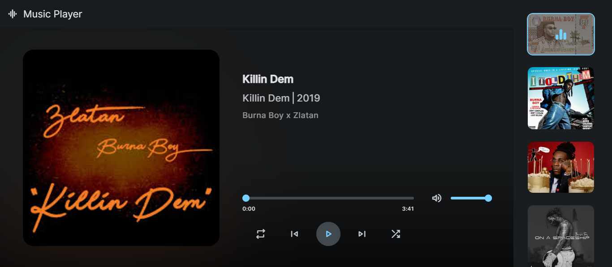

<div align="center">
  <h2 align="center">Music - Web Music Player</h2>

  This is a fully responsive Music website, <br />Responsive for all devices, build using HTML, CSS, and Vanilla JavaScript.

  <a href="https://music-burnaboy.vercel.app/"><strong>➥ Live Demo</strong></a>

</div>

<br />

### Demo Screeshots



### Prerequisites

Before you begin, ensure you have met the following requirements:

* [Git](https://git-scm.com/downloads "Download Git") must be installed on your operating system.

### Run Locally

To run **Music** locally, run this command on your git bash:

Linux and macOS:

```bash
sudo git clone https://github.com/odutolaisreal/Music.git
```

Windows:

```bash
git clone https://github.com/odutolaisreal/Music.git
```

### Contact

If you want to contact with me you can reach me at [Whatsapp](https://wa.me/07060529706).

